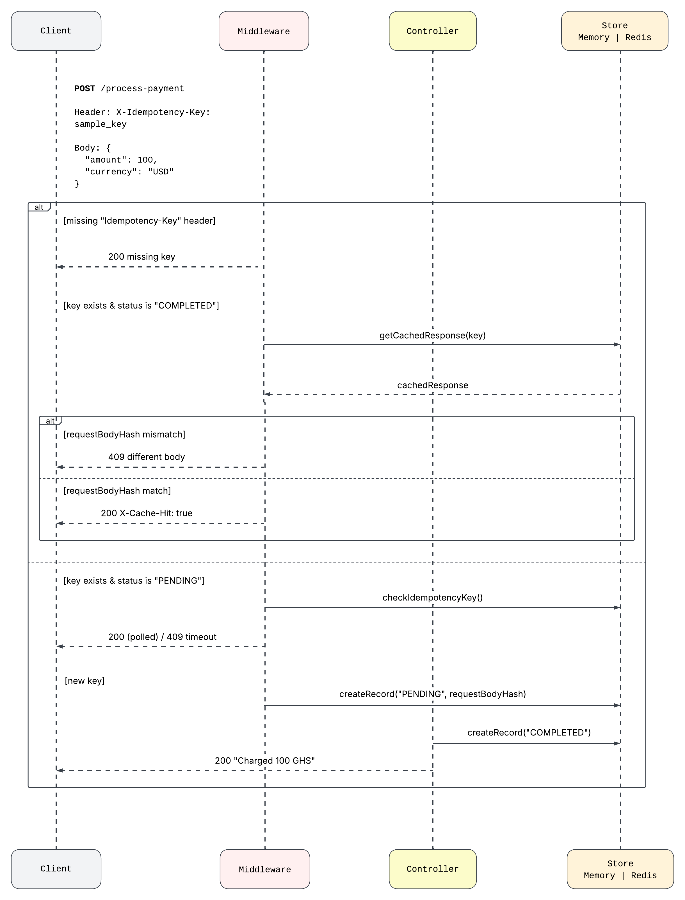

# Idempotency-Gateway (The "Pay-Once" Protocol)
> A "Pay-Once" API layer that ensures payment requests are processed exactly once, no matter how many times they are retried.

---

## 1. Architecture Diagram

### Components

- **Client** — The external system (e.g. an e-commerce store) sending payment requests.

- **Middleware** — The idempotency layer. Every request passes through here first. It checks for the `Idempotency-Key` header, queries the store for its status, and decides whether to process, replay, or reject the request.

- **Controller** — Handles the actual payment logic. Validates the request body with Zod, simulates payment processing, and updates the store with the final response.

- **Store (Memory | Redis)** — Persists idempotency records keyed by `Idempotency-Key`. Each record holds the payment status (`PENDING` or `COMPLETED`), a hash of the request body, and the cached response. Defaults to in-memory in development and Redis in production.

### Flow Summary

A new request hits the middleware. If the key is missing, it's rejected immediately. If the key exists and is `COMPLETED`, the cached response is replayed — unless the request body has changed, in which case it's rejected as a conflict. If the key is `PENDING` (in-flight), the request polls the store until the original completes. If the key is brand new, it's registered as `PENDING` and forwarded to the controller for processing.

## 2. Setup Instructions

## 3. API Documentation

## 4. Design Decisions

## 5. The Developer's Choice
